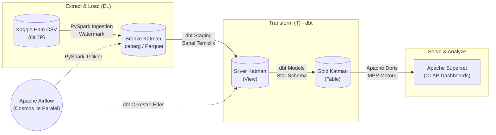
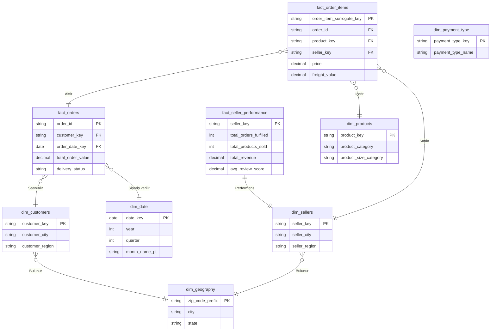

# 🚀 Olist Gelişmiş Büyük Veri Boru Hattı (Modern Data Stack)

Bu proje, Brezilya E-Ticaret Platformu Olist'e ait gerçek veri seti kullanılarak geliştirilmiş, uçtan uca, kurumsal seviyede bir **Büyük Veri (Big Data) ve Veri Mühendisliği** projesidir. Projenin amacı; ham ve dağınık haldeki bir e-ticaret verisinin, en modern veri mühendisliği standartlarında (Modern Data Stack) işlenerek şirket için değerli bir "iş zekası" kararına dönüşme serüvenini sıfırdan inşa etmektir.

---

## 🧠 AI Sunum Üreticisi İçin Kılavuz (Prompt Context)
Bu döküman, yapay zeka araçlarının (ChatGPT, Claude vb.) bu projeden profesyonel bir PowerPoint (.pptx) sunumu hazırlayabilmesi için özel olarak son derece detaylı yazılmıştır. Sunum hazırlarken lütfen aşağıdaki 9 adımı slaytlara bölerek, mimari karşılaştırmaları (Avantaj/Dezavantaj) vurgulayarak ve mühendislik terimlerini (ELT, OLAP, SCD Type 2, DAG) ön plana çıkararak tasarlayın.

---

## 🏛️ Mimari Tasarım (Medallion Architecture)

Proje, veriyi ham halinden en değerli analitik haline kadar katman katman işleyen Medallion yaklaşımını kullanmaktadır:



---

## 🚀 Projenin Teknik Adımları ve Mühendislik Kararları

### 1. Verinin Çıkarılması (Bronze Katmanı ve Iceberg)
Projeye başlarken ham CSV dosyalarını klasik HDFS üzerinde tutmak yerine, üzerine **Apache Iceberg** formatını giydirerek sistemi ACID yetenekleri olan bir **Veri Gölevi (Data Lakehouse)** yapısına çevirdik.
*   **Incremental Loading (Yığın Su İşareti - Watermark):** Sistem gece 03:00'te çalıştığında tüm veriyi baştan okumaz. `watermark.json` dosyasını kontrol eder; sadece yeni gelen veya önceki gün hata almış (FAILED) dosyaları bularak göle **Append (Ekleme)** mantığıyla yazar. Bu sayede veri çiftlenmesi (duplication) önlenir.

### 2. ETL'den ELT'ye Geçiş ve Apache Doris
Faz 1 projelerinde dönüşüm işlemleri Spark üzerinde (ETL) yapılıyordu. Bu projede **ELT (Extract, Load, Transform)** yaklaşımına geçtik.
*   **Neden ELT?** ETL'de veri ağ üzerinden RAM'e çekilir (darboğaz yaratır). ELT'de ise hesaplama veritabanına itilir (Pushdown), ağ maliyeti sıfırlanır.
*   **HDFS vs Doris:** HDFS ucuz disklerde devasa ham verileri saklamak için mükemmeldir. Apache Doris ise inanılmaz hızlı, sütun bazlı ve MPP (Devasa Paralel İşleme) yeteneklerine sahip gerçek zamanlı bir analitik veritabanıdır. dbt, Doris'in "External Catalog" yeteneğini kullanarak HDFS'i okur; yani dbt sadece SQL ile Doris'e emir verir, asıl ağır yükü Doris kaldırır.

### 3. SQL vs Spark ve dbt'nin Gücü
Sadece SQL kullanmak statiktir, test edilemez. Sadece Spark kullanmak donanım canavarıdır. **dbt (Data Build Tool)** bu iki dünyayı birleştirir.
*   İçine gömülü Jinja (Python) şablonları ile saf SQL'e programlanabilir bir beyin ekler. Yazılan modelleri derleyerek (compile) Doris'in anlayacağı saf SQL'e dönüştürür.

### 4. Temizlik ve Standartlaştırma (Silver / Staging Katmanı)
Silver katmanında fiziki veri kopyalaması yapılmaz; veriler disk israfını önlemek için **Sanal Tablo (View)** olarak oluşturulur.
*   Boş verilerin silinmesi veya mükerrer (`DISTINCT`) kayıtların ayıklanması doğrudan `.sql` modellerinin içinde çözülür (DLQ yerine doğrudan kod içi filtre).
*   **Çift Dikiş (Defense in Depth):** SQL içindeki filtrelemeye ek olarak `schema.yml` dosyasına `not_null` ve `unique` testleri yazılarak bozuk verinin Gold katmana sızması kesin olarak engellenir.

### 5. İş Modelleri (Gold Katmanı) ve OLTP'den OLAP'a Geçiş
Kaynak veritabanı (Olist) siparişleri hızlı kaydetmek için tasarlanmış dağınık bir **OLTP (Online Transaction Processing)** sistemidir. İş zekası analistleri ise milyonlarca satırı saniyeler içinde okumak (**OLAP**) isterler.
*   **Star Schema (Yıldız Şema):** Karmaşık OLTP verisini alıp merkezde `fact_orders` (ciro vb.) ve etrafında onu açıklayan `dim_customers`, `dim_products` gibi tabloların olduğu denormalize bir yapıya çevirdik. 
*   **Overwrite Stratejisi:** Gold katmanında 100 bin satırlık veriyi incremental işlemek yerine kodu basit tutmak adına (Keep it simple) her gün baştan silip yaratan (Overwrite - Table) stratejisini seçtik. Çünkü Doris bu kadar küçük bir veriyi saniyeler içinde baştan yaratabilir.

### 6. dbt'nin Gelişmiş Kurumsal Özellikleri
*   **Seeds:** Eyalet kodları gibi değişmeyen statik referans verileri CSV olarak yüklenir ve otomatik tablo yapılır.
*   **Macros:** DRY (Don't Repeat Yourself) prensibiyle, uzun `CASE WHEN` blokları fonksiyonlaştırılarak tekrar tekrar kullanılır.
*   **Analyses:** Kalıcı tablo gerektirmeyen tek seferlik ad-hoc analizler için kullanılır.
*   **state:modified Komutu:** CI/CD süreçlerinde devrim yaratır. Kod güncellendiğinde 100 tablonun tamamını değil, sadece kodu değişen tabloları (ve bağımlılarını) `dbt build -s state:modified+` ile tetikleyerek devasa compute tasarrufu sağlar.

### 7. Zaman Makinesi: Müşteri Tarihçesi Takibi (SCD Type 2)
Bir müşterinin ili değiştiğinde geçmişi silip üstüne yazmak (SCD 1 / Incremental) geçmiş analizlerini bozar. Biz dbt **Snapshots** özelliğini kullanarak **SCD Type 2** metodolojisini kurduk.
*   `strategy='check'` özelliği sayesinde adres kolonu değiştiği an eski kaydın `valid_to` tarihini kapatır, altına güncel tarihi `valid_from` olarak basıp yeni satır açar. Sistem zaman makinesine dönüşür.

### 8. Orkestrasyon ve Paralel Çalışma (Airflow ve Cosmos)
Projenin kalbi Apache Airflow'dur. Her gece 03:00'da çalışır, hataları 3 kez dener, zaman aşımında (SLA) uyarı atar.
*   **Astronomer Cosmos:** Normalde dbt'yi Airflow'da çalıştırırsanız tek bir dev kara kutu görünür. Cosmos ise dbt klasörünü okur ve içindeki SQL modellerini otomatik olarak Airflow görevlerine (tasks) dönüştürür.
*   **Paralel Çalışma:** Airflow zaten doğası gereği bağımsız görevleri paralel çalıştırır. Cosmos'un bu dönüşümü yapması sayesinde Airflow, dbt'nin bağımlılık haritasına (DAG) bakar ve alakasız tabloları aynı anda (paralel) çalıştırarak sistemi muazzam hızlandırır.

### 9. Dashboard Devrimi (Spark Thrift vs Apache Doris)
Eski yapılarda BI araçları SQL konuştuğu için araya Spark Thrift Server konulurdu. Bu da SQL'i Spark işlerine çevirirken devasa JVM başlatma sürelerine (Latency) ve eşzamanlı analist girdiğinde bellek hatalarına (Concurrency çöküşü) neden olurdu.
*   **Neden Doris?** Biz Apache Superset'i doğrudan Doris'e bağladık. Doris zaten sıfırdan C++ ile SQL konuşmak için yazılmıştır. **Zone Map** (Blok Haritası) indeksleri sayesinde tüm veriyi taramaz, grafiğin noktasını saniyeden kısa sürede getirir. Çevirici köprü (Thrift) ortadan kalktığı için milisaniye hızında Dashboard'lar elde edildi.

---

## 🌟 Veri Modelleme ER Diyagramı (Star Schema)



---

## 📸 Superset Analitik Dashboard

Projemizin çıktısı olan ve otomatik Python API scriptleri ile saniyeler içinde Superset üzerinde ayağa kalkan interaktif Olist Dashboard'undan görüntüler:


---

## 📂 Dosya ve Klasör Hiyerarşisi

Aşağıda projenin temiz ve modüler dosya ağacını görebilirsiniz:

```text
AdvancedBigDataPipeline/
├── Makefile                        # Tüm kurulum ve çalıştırma komutlarının bulunduğu merkezi araç
├── README.md                       # Proje dokümantasyonu (Bu dosya)
├── Dashboards/                     # Superset üzerinden alınan rapor ekran görüntüleri
├── airflow/                        # Airflow DAG'leri ve Astronomer konfigürasyonları
│   └── dags/
├── config/                         # Veritabanı, Spark ve diğer servis bağlantı ayarları
├── data/                           # Kaggle'dan indirilen Olist CSV dosyaları
├── docker/                         # Docker Compose YAML dosyaları (Doris, Superset, Airflow vb.)
├── olist_dbt/                      # dbt veri dönüşüm projesi
│   ├── dbt_project.yml
│   ├── macros/                     # SQL makroları (örn: get_brazil_region)
│   ├── models/
│   │   ├── staging/                # Silver katman (Veri temizleme ve tekilleştirme)
│   │   └── marts/                  # Gold katman (Fact ve Dimension tabloları)
│   ├── seeds/                      # Referans verileri (brazil_states.csv)
│   └── tests/                      # Veri doğrulama testleri
├── processing/                     # PySpark veri içe aktarma scriptleri (Bronze Ingestion)
├── scripts/                        # Otomasyon scriptleri (Veri indirme, ağ kurma vb.)
└── visualization/                  # Superset API otomasyon klasörü
    ├── cleanup.py                  # Eski dashboard'ları temizler
    ├── create_dashboard.py         # Grafikleri ve Dashboard'u sıfırdan kurar
    └── register_tables.py          # Veritabanı tablolarını Superset datasetlerine çevirir
```

---

## 🛠️ Kullanılan Teknolojiler
*   **Veri Çıkarma (Ingestion):** PySpark
*   **Veritabanı / Veri Ambarı:** Apache Doris
*   **Veri Dönüştürme:** dbt (Data Build Tool)
*   **Orkestrasyon:** Apache Airflow & Astronomer Cosmos
*   **Veri Görselleştirme:** Apache Superset

---

## 🚀 Projeyi Çalıştırma (Kurulum Kılavuzu)

### 1. Servisleri Başlatma
Tüm altyapı (Hadoop, Doris, Airflow, Superset) Docker üzerinde çalışır:
```bash
make setup
```

### 2. Veri Boru Hattını (Pipeline) Tetikleme
PySpark veriyi göle indirir ve dbt tüm dönüşüm/test süreçlerini çalıştırır:
```bash
make download
make pipeline
```

### 3. Superset (Dashboardlar)
Raporları ve panelleri oluşturmak için:
```bash
make dashboard
```
Erişim: `http://localhost:8088` (admin/admin).
